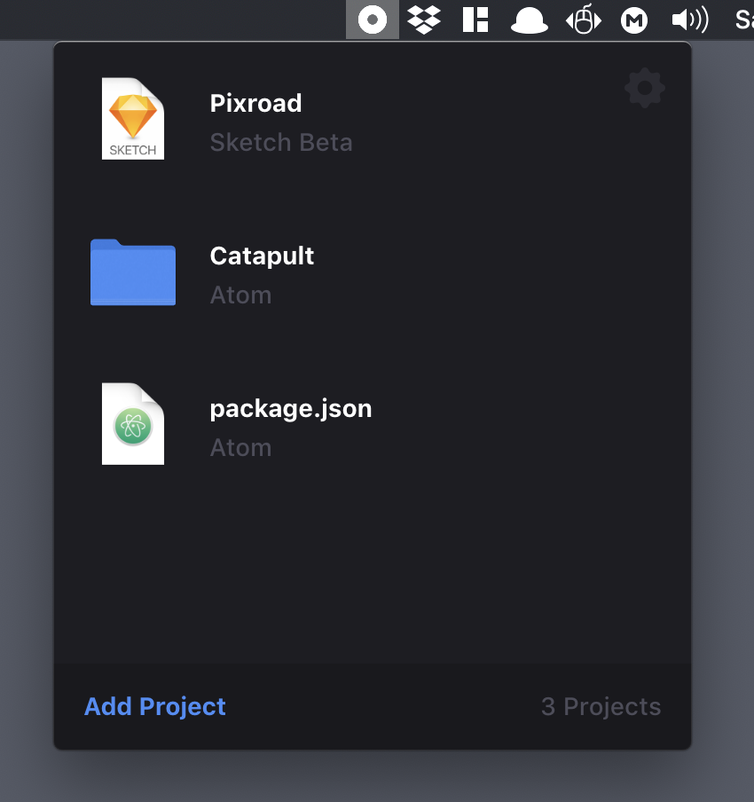

     

# Catapult for macOS

Catapult is a simple macOS app based on [Electron](https://github.com/electron/electron) that helps you open your projects more easily.
Drag and drop any folder or file and select which app you want to open it with.
A new project is created and you can access it quickly in the top menu by clicking on it.  

     

### Download
[Latest Release](https://github.com/cerpow/catapult/releases)

### Created by
Voicu Apostol  
https://www.pixroad.com
